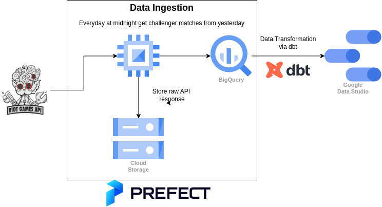

# Leauge of Legends Challenger Stats

For my final project in the [de-zoomcamp course](https://github.com/DataTalksClub/data-engineering-zoomcamp), I built a data pipeline that continuously fetches data from the League of Legends API. Every day, I ingest the previous day's matches, aggregate the data, and display it on a Google dashboard. To gather data, I collected the match histories of the top 0.01% of players (Challenger) games'. By analyzing their match histories, I aimed to identify the best times to play League of Legends.

After analyzing the data, I found that the worst games are played early in the morning, between 00:00 and 08:00 AM. However, since I have only collected data on 8.4k games so far, this conclusion is not yet certain. I plan to continue collecting data over the next few days to see if this trend holds up. Even though the results are still preliminary, they suggest that players should avoid playing League of Legends in the early morning hours if they want to have better games.

## Architecture



## Setup

### Leauge of Legends API

1. Create a leauge of legends account. (https://developer.riotgames.com/)

2. Use development `DEVELOPMENT API KEY` to call the API.
    
    **Note:** *The API key will reset everyday so you need to renew it. If you don't want to renew it everyday then you need to apply for personal API key which takes 10 bussiness days to get it.*


### Prefect

1. Create a `Prefect Cloud Account` [[link](https://www.prefect.io/cloud/)]

2. Create a `Prefect Workspace` 

3. Jump to the `Cloud Step`

4. Download the service account that is created by terraform.

5. Create `Prefect Blocks`
    ```bash
    cd prefect
    pip install -r requiremetns.txt
    prefect cloud login
    python blocks.py --sa_path="$SA_PATH" --riot_api_key="$RIOT_API_KEY"
    python deployment.py
    ```

6. Do a Test Run

### Cloud

1. Create Google Cloud Account

2. Install `Terraform` [[link](https://developer.hashicorp.com/terraform/downloads)] and `gcloud-cli` [[link](https://cloud.google.com/sdk/docs/install)]

4. Create a `GCP Project` 

    **Note:** *You mush have owner permissions in the project to able to run terraform.*

3. Build the infra.
    ```bash
    cd terraform
    terraform init
    terraform apply \
        -var="project=$PROJECT_ID" \
        -var="prefect_key=$PREFECT_API_KEY" \
        -var="prefect_account_id=$PREFECT_ACCOUNT_ID" \
        -var="prefect_workspace_id=$PREFECT_WORKSPACE_ID" \
        --auto-approve
    ```

### DBT

1. Setup a `dbt cloud` account.

1. Follow instructions to `setup bigquery connection` [[link](https://github.com/DataTalksClub/data-engineering-zoomcamp/blob/main/week_4_analytics_engineering/dbt_cloud_setup.md)]

2. Connect this github repo to dbt cloud and specify the subdirectory as `dbt`.

3. Run `dbt build` 